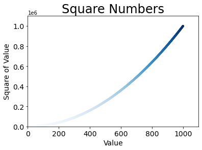

# test-1
exc github


my github front page

markdown

# GITHUB

##### GITHUB

----------

- - - 

********

* * * 

1. push
2. pull VS fetch

+ origin
- pull
* push

- 1
  - 1.1
  - 1.2
    - 1.2.1
    - 1.2.2

**bold1**
__bold2__

*italic*
_italic2_


***bold_italic___
___bold_italic___

> ref1
>> ref2
>>> ref3?


`src` injection

```
multi
src
```
injection

link: <https://google.com>
[link2](https://google.com)
[link3](https://google.com, "google link")



